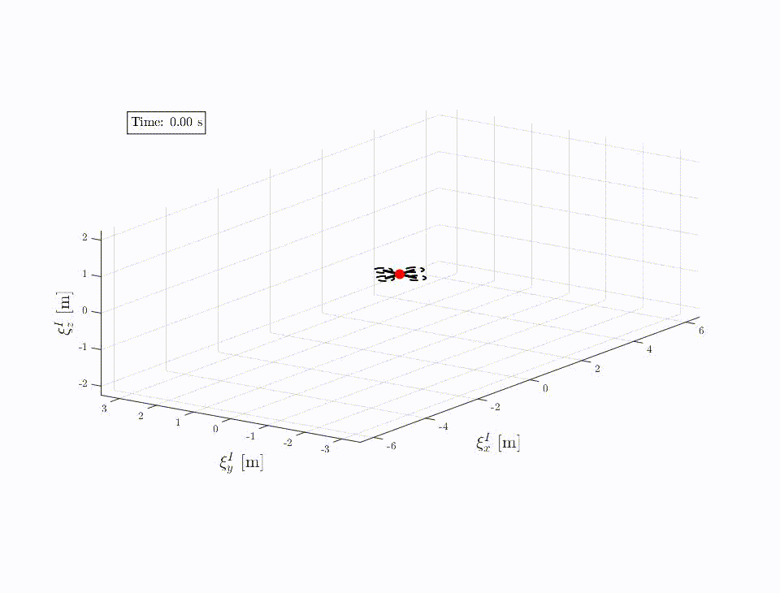

# Estimation-Aware Control

### Introduction
Traditional control architectures rely heavily on the **Certainty Equivalence (CE)** principle, which cleanly separates state estimation from control design. While this decoupling works beautifully in ideal linear systems, it quickly breaks down during aggressive maneuvers and under severe disturbances. 

Our framework abandons the "blind" CE assumption. By actively incorporating estimation quality (uncertainty) directly into the feedback law, we structurally isolate estimation-induced feedback loops. This mitigates severe cross-coupling and prevents catastrophic divergence under unmodeled disturbances.

  

---

### Intuition: Why Pure Prediction Fails

To understand why estimation-aware control is necessary, imagine a simple pendulum. We can fully describe its state using just two variables: **angular position** ($\theta$) and **angular rate** ($\dot{\theta}$). 

In an ideal, deterministic world, basic calculus and physics allow us to perfectly predict and capture its behavior over time:

<table align="center">
  <tr>
    <td align="center">
      
       
      <b>Ideal Pendulum Motion</b>
    </td>
    <td align="center">
      
       
      <b>Deterministic State Evolution</b>
    </td>
  </tr>
</table>

In reality, however, a naive predictive model fails to accurately capture the true system behavior due to three inherent physical limitations:

1. **Non-Determinism:** Mathematical process models can only describe nominal behavior based on initial conditions. They ignore unpredictable internal dynamics and external environmental inputs (such as wind gusts or friction variations) that occur over time.
2. **Noisiness:** Real-world systems suffer from both process noise (unmodeled physical disturbances) and measurement noise (inherent sensor inaccuracies). Without feedback correction, these errors accumulate and compound over time.
3. **Undersampling & Discretization:** Physical microcontrollers operate on discrete time steps. Integrating continuous-time physics at discrete intervals introduces truncation errors, which can destabilize a purely predictive controller.

As shown below, when we introduce these real-world stochastic effects, the actual states quickly drift away from our deterministic predictions:

<table align="center">
  <tr>
    <td align="center">
      
       
      <b>Stochastic Pendulum Behavior</b>
    </td>
    <td align="center">
      
       
      <b>Actual vs. Predicted State Drift</b>
    </td>
  </tr>
</table>

---

### The Limits of Standard Feedback Control

This fundamental challenge persists even when we introduce standard feedback control to stabilize the system in an upright position. Model inaccuracies, combined with persistent external disturbances, significantly complicate the controller's task. 

In demanding scenarios, traditional feedback struggles, leading to highly degraded control performance or outright instability:

  

Achieving marginal stability under these conditions is notoriously difficult. It often demands restrictive workarounds, such as forcing higher sampling rates, increasing control loop bandwidth, or relying on fragile, ad-hoc manual weight tuning:

  

---

### The Solution: Estimation-Aware Control

**This is where Estimation-Aware Control steps in.** 

Rather than relying on fragile tuning, our framework continuously quantifies how much our state estimate is drifting (the estimation covariance) and feeds this real-time uncertainty *back* into the control action. 

By closing the loop on estimation quality, the controller dynamically modulates its aggressiveness—softening control effort during high uncertainty to prevent self-excitation, and sharpening its response when confidence is restored. This mathematically guarantees stability and robustness, even in the presence of severe state drift and unmodeled disturbances.