&nbsp; &nbsp;  &nbsp;  &nbsp; &nbsp;  &nbsp;  &nbsp; &nbsp;  &nbsp;  &nbsp; &nbsp;  &nbsp;  &nbsp; &nbsp;  &nbsp;  &nbsp;  

# Estimation-Aware Control

### Introduction
Traditional control architectures rely heavily on the **Certainty Equivalence (CE)** principle, which cleanly separates state estimation from control design. While this decoupling works beautifully in ideal linear systems, it quickly breaks down during aggressive maneuvers and under severe disturbances. 

Our proposed [Estimation-Aware](https://arxiv.org/abs/2607.07276) framework abandons the "blind" CE assumption. By actively embedding estimation quality (uncertainty) directly into the feedback law, we structurally decouple and isolate estimation-induced feedback loops. Compared to the nominal baseline (brown), the EA framework (green) successfully mitigates severe cross-coupling and prevents catastrophic divergence under unmodeled disturbances.

<p align="center">
  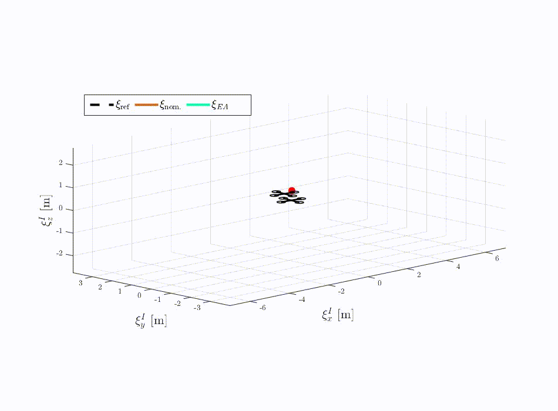
</p>

---

### Intuition: Why Pure Prediction Fails

To understand why estimation-aware control is necessary, imagine a simple pendulum. We can fully describe its state using just two variables: **angular position** ($\theta$) and **angular rate** ($\dot{\theta}$). 

In an ideal deterministic setting, first-principles physics allows us to perfectly predict system dynamics, subject only to sampling limits:

<table align="center">
  <tr>
    <td align="center">
      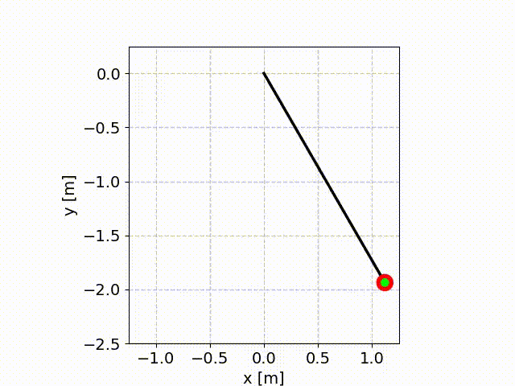
      <br />
      <sub><b>Ideal Pendulum Motion</b></sub>
    </td>
    <td align="center">
      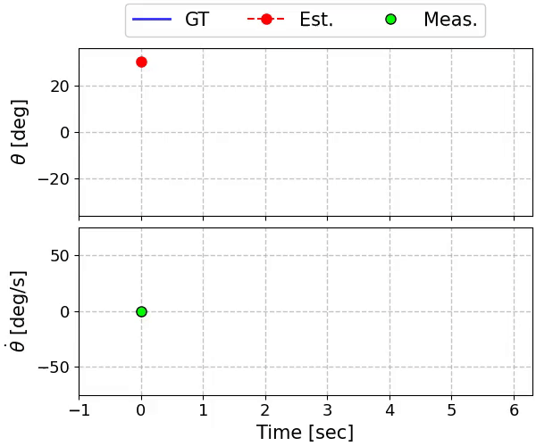
      <br />
      <sub><b>Deterministic State Evolution</b></sub>
    </td>
  </tr>
</table>

In reality, however, a naive predictive model fails to accurately capture the true system behavior due to three inherent physical limitations:

1. **Non-Determinism:** Mathematical process models can only describe nominal behavior based on initial conditions. They ignore unpredictable internal dynamics and external environmental inputs (such as wind gusts or friction variations) that occur over time.
2. **Noisiness:** Real-world systems suffer from both process noise (unmodeled physical disturbances) and measurement noise (inherent sensor inaccuracies). Without feedback correction, these errors accumulate and compound over time.
3. **Undersampling & Discretization:** Physical microcontrollers operate on discrete time steps. Integrating continuous-time physics at discrete intervals introduces truncation errors, which can destabilize a purely predictive controller.

When these are taken into account, drift becomes inevitable, as the estimates fail to accurately capture the true system states:

<table align="center">
  <tr>
    <td align="center">
      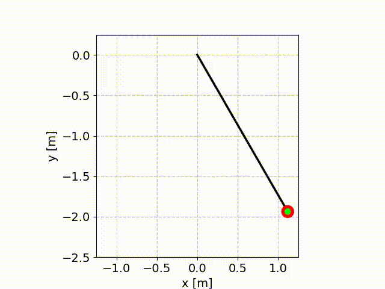
      <br />
      <sub><b>Stochastic Pendulum Behavior</b></sub>
    </td>
    <td align="center">
      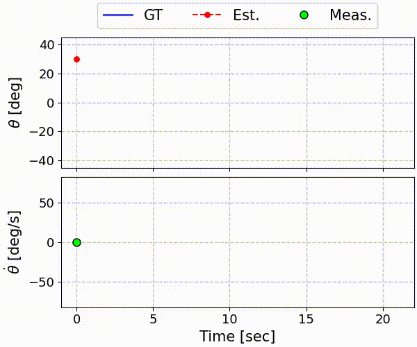
      <br />
      <sub><b>Actual vs. Predicted State Drift</b></sub>
    </td>
  </tr>
</table>

---

### Does Standard Feedback Control Helps ?

This fundamental challenge persists even when we introduce standard feedback control to stabilize the system in an upright position. Model inaccuracies, combined with persistent external disturbances, significantly complicate the controller's task. In demanding scenarios, traditional feedback struggles, leading to highly degraded control performance or outright instability:

<p align="center">
  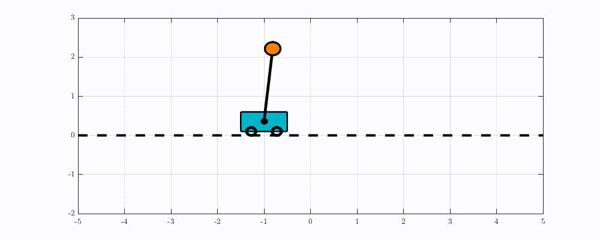
</p>

Achieving marginal stability under these conditions is notoriously difficult. It often demands restrictive workarounds, such as forcing higher sampling rates, increasing control loop bandwidth, or relying on fragile, ad-hoc manual weight tuning:

<p align="center">
  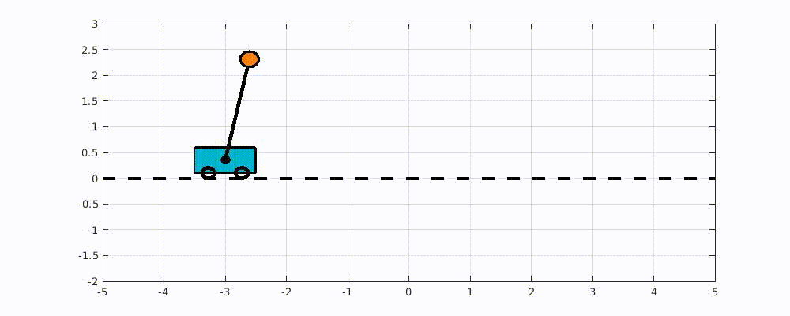
</p>

---

### The Solution: Estimation-Aware Control
Rather than relying on manual tuning, our framework feeds real-time estimation uncertainty—quantified via covariance—directly back into the control loop. Agnostic to the control design, this paradigm structurally regularizes the control action to respect the estimator's "blindness" within the feasible space.

In this work, we apply this framework to an incremental nonlinear dynamic inversion (INDI) control law (1, blue), which computes a control increment at step $k$ (2, magenta) augmented by our Estimation-Aware (EA) term (3, orange). This term maps the covariance matrix $\boldsymbol{\Sigma}_k$ into an uncertainty-gated operator (4, green) that dynamically attenuates or cross-projects $\dot{\hat{\boldsymbol{x}}}_k$ to guarantee stability.

<p align="center">
  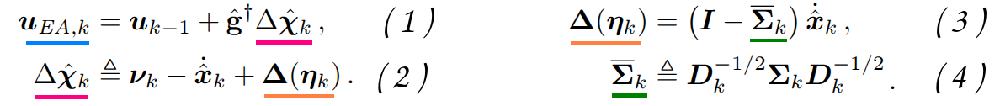
</p>

By closing the loop on estimation quality, the controller dynamically modulates its aggressiveness—softening control effort during high uncertainty to prevent self-excitation, and sharpening its response when confidence is restored. This mathematically guarantees stability and robustness, even in the presence of severe state drift and unmodeled disturbances.

<table align="center">
  <tr>
    <td align="center">
      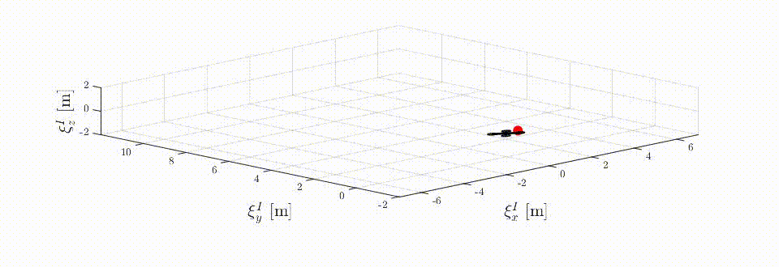
      <br />
      <sub><b>EA-based</b></sub>
    </td>
  </tr>
  <tr>
    <td align="center">
      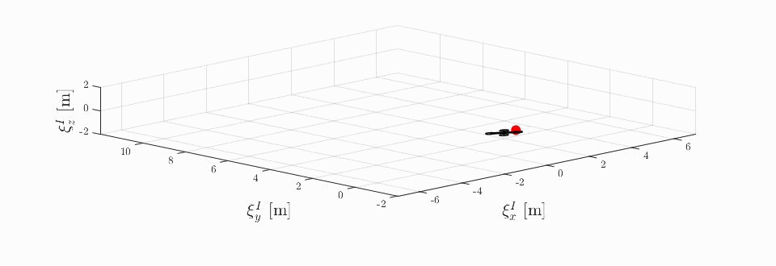
      <br />
      <sub><b>Nominal</b></sub>
    </td>
  </tr>
</table>

bla bla bla bla bla bla bla bla bla bla bla bla bla bla bla bla bla bla bla bla bla bla bla bla bla bla bla bla bla bla bla bla bla bla bla bla bla bla bla bla bla bla bla bla bla bla bla bla bla bla bla bla bla bla bla bla bla bla bla bla bla bla bla bla bla bla bla bla bla bla bla bla bla bla bla bla bla bla bla bla bla bla bla bla bla bla bla 


<table align="center">
  <tr>
    <td align="center">
      
      <br />
      <sub><b>EA-based</b></sub>
    </td>
  </tr>
  <tr>
    <td align="center">
      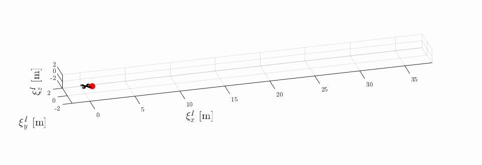
      <br />
      <sub><b>Nominal</b></sub>
    </td>
  </tr>
</table>

## Code

The code can be implemented using MATLAB R2022b or any later releases, and is organized as follows :

### Directory tree
<pre>
[root directory]
├── code
|   ├── main.m
|   ├── S_Init.m
|   ├── S_Solve.m
|   ├── f_Runga_Kutta.m
    ...
|   ├── 
    └── u_saturation.m
├── data
...
└── requirements.txt
<!--  Readme.md -->
</pre>

File | Purpose
--- | --- 
**main** | Main Launcher file
**S_Solve** | Nonlinear incremental solver using state and control jacobians
**f_Runga_Kutta** | 4-th order numerical solver for **f(x_k,u_k)**
**System_Parameters** | Upload all relevant system parameters
**u_saturation** | Actuation physical limitations


## Citation

If you find this repository useful, please consider giving it a star ⭐ and citing our article :
```
@article{engelsman2026revisiting,
  title={Revisiting Certainty Equivalence: The Structural Coupling Between Estimation and Control in Underactuated Nonlinear Systems},
  author={Engelsman, Daniel and Klein, Itzik},
  journal={arXiv preprint arXiv:2607.07276},
  year={2026}
}
```

[](https://arxiv.org/abs/2607.07276)
